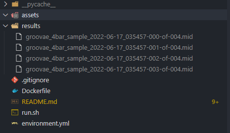

# PROJECT ASSUMPTIONS
1. Pretrained model can be use
1. Groovae 4bar config is used
1. The dataset of Groovae 4bar is downloaded using "tsds_name" in `config.py` 
1. You can deploy and use this program everywhere as long as docker is installed
1. The output of this program is 4 (four) .mid files created by MusicVAE model

# HOW TO RUN:
1. Clone this repository
1. Make sure you have docker installed
1. Build the image named `pormagenta`  (maybe you need to wait for few minutes)
    ```bash
    docker build -t pormagenta . 
    ```
1. Run the image
    ```bash
    docker run --rm -ti -v $PWD/results:/home/results pormagenta
    ```

# Prove
